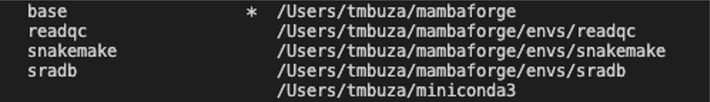

--- 
title: "<big>IMAP:</big> Integrated Microbiome Analysis Pipelines"
subtitle: "End-to-End Practical User Guides Using Integrated Approaches"
date:
- <b>`r Sys.Date()`</b>
author: Teresia Mrema-Buza
site: bookdown::bookdown_site
documentclass: book
css: style.css
csl: 
  - library/apa.csl
bibliography:
  - library/packages.bib
  - library/references.bib
  - library/imap.bib
citation_package:
  - natbib
  - biblatex
  - amsplain
url: https://tmbuza.github.io/imap-project-overview/
cover-image: images/planning.png
email_address: "ndelly@gmail.com"
github-repo: tmbuza/imap-project-overview
biblio-style: apalike
description: |
  | This part will be added before release.
---

```{r lockfile, include=FALSE}
source("_common.R")

# renv::use("compiler", 
#           "bookdown", 
#           "fastmap", 
#           "cli", 
#           "htmltools", 
#           "tools", 
#           "rstudioapi", 
#           "yaml", 
#           "rmarkdown", 
#           "knitr", 
#           "xfun", 
#           "digest", 
#           "rlang")
```


<!-- # Google fonts -->
<link rel="preconnect" href="https://fonts.googleapis.com">
<link rel="preconnect" href="https://fonts.gstatic.com" crossorigin>
<link href="https://fonts.googleapis.com/css2?family=Anton" rel="stylesheet">
<link href="https://fonts.googleapis.com/css2?family=Roboto:wght@100;300;400;500;700,900&display=swap" rel="stylesheet">
<link href="https://fonts.googleapis.com/css2?family=Oswald:wght@300;400;700&display=swap" rel="stylesheet">
<link href="https://fonts.googleapis.com/css2?family=Merriweather:wght@300;400;700&display=swap" rel="stylesheet">
<link href="https://fonts.googleapis.com/css2?family=Montserrat:wght@100;200;300;400;700&display=swap" rel="stylesheet">

<!-- # CSS -->
<link rel="stylesheet" href="https://cdnjs.cloudflare.com/ajax/libs/font-awesome/5.15.3/css/all.min.css">
<link rel="stylesheet" href="https://cdnjs.cloudflare.com/ajax/libs/animate.css/4.1.1/animate.min.css">


# <big>Software Toolkit for Microbiome Data Analysis</big> {-#software-requirement}

<br>
<br>

<br>
<br>

Greetings, fellow explorers! 
# 


<!--chapter:end:index.Rmd-->

## Basic software
We must install all essential tools to get started and ensure they run smoothly. Examples of required software include:

- Environment and package management system.
- Workflow management system.
- Quality control tools.
- Bioinformatics analysis pipelines.
- Data analysis software.
- More tools as needed.


<!--chapter:end:00-preface.Rmd-->

# Environment & package management system
## Install conda
Conda is a package manager obtained via Miniconda or Anaconda.

- For a complete installation guide, click [here](https://conda.io/projects/conda/en/latest/user-guide/install/index.html).
- For documentation, click [here](https://docs.conda.io/en/latest/).
- Miniconda: https://docs.conda.io/en/latest/miniconda.html
- Anaconda: https://docs.anaconda.com/
- Getting started with Conda: Click [here](https://docs.conda.io/projects/conda/en/latest/user-guide/getting-started.html).


## Install mamba
> Mamba is a CLI tool to manage conda environments

- Mamba can be obtained via Mambaforge.
- For a complete installation guide, click [here](https://mamba.readthedocs.io/en/latest/installation.html).
- For documentation, click [here](https://mamba.readthedocs.io/en/latest/user_guide/mamba.html).


### Demo installing Miniconda3 for Mac OS
```bash
curl -L  https://repo.anaconda.com/miniconda/Miniconda3-latest-MacOSX-x86_64.sh -o Miniconda3-latest-MacOSX-x86_64.sh
bash Miniconda3-latest-MacOSX-x86_64.sh
```

### Demo installing Mambaforge for Mac OS
```bash
curl -L https://github.com/conda-forge/miniforge/releases/latest/download/Mambaforge-MacOSX-x86_64.sh -o Mambaforge-MacOSX-x86_64.sh
bash Mambaforge-MacOSX-x86_64.sh
```

## Setting up common channels
We will be using lots of bioinformatics and analysis tools. 

> - Note that most bioinformatics tools are via the `bioconda` channel. 
> - Most analysis tools are installed via the `conda-forge` channel.
> - Some metagenomics analysis tools described in this guide are installed via the `biobakery` channel. 

```bash
conda config --add channels defaults
conda config --add channels bioconda
conda config --add channels conda-forge
conda config --add channels biobakery
conda config --add channels qiime2
conda config --add channels "qiime2/label/r2023.2"
conda config --set auto_activate_base False
```

## Creating a conda environment

### Using conda
```bash
conda activate base
conda create --name imap
conda create --name imap python==10
conda create --name imap python==10 pandas numpy seaborn
```
> Note: Each command line creates the environment `imap` in the base environment, so choose a line that suits you best.

### Using mamba
```bash
mamba create -c bioconda --name imap
mamba create --name imap python==10
mamba create --name imap python==10 pandas numpy seaborn
```

## Activating and deactivating the environment
```bash
conda activate imap

conda deactivate imap
```

> - After setting up the channels and creating an environment, we can install more software. 
> - For installation, we will use `Mamba package manager` instead of `Conda package manager` because it is much faster. 

## Updating conda
```bash
conda update conda

mamba update conda
```

## Checking the conda version
```bash
conda -V

mamba -V
```

## Reproducing existing environment
Requires an environment `spec` file or a `yml` file

### Creating an env spec file
```bash
conda list --explicit > env_spec_file.txt
```

### Creating a new environment from a spec file
```bash
conda create --name new_env --file env_spec_file.txt
```

### Installing packages from a spec file
```bash
conda install --name existing_env --file env_spec_file.txt
```

### Creating new env from a YAML file
- First, create the YAML or YML file:
  - `environment.yml`
  - `environment.yaml`
  - Here, we save the environment.yml file in the `workflow/envs` folder, and it is configured to contain the following:

```bash
name: imap
channels:
  - conda-forge
  - bioconda
  - defaults
  - r
dependencies:
  - snakemake =7.19.1
  - snakemake-minimal =7.19.1
  - snakemake-wrapper-utils =0.5.0
  - snakedeploy =0.8.6
  - python =3.8.0
  - r-base =4.1.3
  - r-tidyverse =1.3.2 
  - r-bookdown =0.32
  - r-htmltools =0.5.4 
  - r-htmlwidgets =1.6.1
  - r-leaflet =2.1.1
  - r-leaflet.providers =1.9.0 
  - r-rmarkdown =2.20
  - r-schtools =0.4.0
  - graphviz =6.0.1
  - qiime2 =2023.2.0
  - mothur =1.48.0
  - vsearch =2.22.1
  - q2-vsearch =2023.2.0
```

```bash
conda activate base
mamba env create --name imap --file environment.yaml
```

## Checking available environments
If everything goes smoothly, you should see the newly created environment. It will be ready to be activated. Great!
```bash
conda env list

conda info --envs

mamba env list

mamba info --envs
```

```bash
conda activate imap
```

## Removing an environment
> Must deactivate the environment before removing it.

```bash
conda env list
```


```bash
conda deactivate

conda env remove --name imap

conda remove --name imap --all

conda env list
```

## Miscellaneous queries with `repoquery`

### Search all package version
```bash
 mamba repoquery search snakemake --channel bioconda 

 mamba repoquery search python --channel conda-forge 
```

### List package dependencies
```bash
mamba repoquery depends snakemake --channel bioconda

mamba repoquery depends python --channel conda-forge
```

### List which packages depend on
```bash
mamba repoquery whoneeds snakemake --channel bioconda

mamba repoquery whoneeds python --channel conda-forge
```

<!--chapter:end:01_env_pkg_mngers.Rmd-->

# Snakemake workflow management system

## Install snakemake
- Snakemake [@Koster2021] software is best installed via the Mamba package manager or Mambaforge. 
- We first need to confirm if conda or mamba are installed and proceed from there.

```bash
mamba install -c bioconda snakemake
```

## Install snakemake minimal
```
mamba install -c bioconda snakemake-minimal
```

## Install snakemake wrappers
```
mamba install -c bioconda snakemake-wrapper-utils
```

## Install SnakeDeploy
- Snakedeploy [@Snakedeploy2023] deploys a snakemake pipeline from version control like GitHub.

```bash
mamba install -c bioconda snakedeploy
```

## Installing using `environment.yml`
```bash
name: snakemake
channels:
    - bioconda
dependencies:
    - snakemake =7.19.1
    - snakemake-minimal =7.19.1
    - snakedeploy =0.8.6
    - snakemake-wrapper-utils =0.5.0
```

```bash
conda activate base
mamba env create --name snakemake --file environment.yaml
```

<!--chapter:end:02_workflow_mngers.Rmd-->

# Data Science & Visualization Tools
The most powerful tools for analyzing and visualizing microbiome data include:

- R and RStudio
- R-markdown
- Python
- Jupyter notebook


<!-- # Basic Software -->
## Installing R Environment 

<!-- <a href=""></a> -->
**R** is free software for statistical computing, data analysis, and graphics [@RCoreTeam2021]. We can install the R application on a personal computer to process the R programming language. You can download and install R using these steps:

1. Go to [https://www.r-project.org/](https://www.r-project.org/).
2. On the left, under Download, click on [CRAN](http://cran.r-project.org/mirrors.html) to access the mirrors. CRAN (Comprehensive R Archive Network) is mirrored on nearly 100 registered servers in almost 50 regions worldwide. See [CRAN mirror status](https://cran.r-project.org/mirmon_report.html).
3. https://cloud.r-project.org/ Pick a mirror close to your location, and automatically R will connect to that server, ready to download the package files.
4. Select a compatible platform to download precompiled binary distributions of the base system, which also come with contributed packages.

<br>

## Installing RStudio Environment

<!-- <a href=""></a> -->

**RStudio** is a free program integrating with R as an IDE (Integrated Development Environment) to implement most analytical functionalities [@RStudioTeam2021]. For effective analysis, we must install R before installing RStudio. We will intensively use RStudio IDE to give us a user interface. We are interested in **RStudio Desktop**, which is an open-source regular desktop application. You can install it like this:

1. Go to [https://rstudio.com/products/rstudio/](https://rstudio.com/products/rstudio/).
2. Click on [RStudio Desktop](https://rstudio.com/products/rstudio/#rstudio-desktop) box to move to the open source edition.
3. Choose your preferred [license](https://rstudio.com/products/rstudio/download/) either open source or commercial.
4. Select [installer](https://rstudio.com/products/rstudio/download/#download) compatible to your operating system.

<br>


<br>

## Installing Python
Python is installed through several methods. The most famous ways include:

- Direct [downloads](https://www.python.org/downloads/)
- Via environment and package management systems, for example [using conda](https://www.practicaldatascience.org/html/setup_python.html) like so:

```bash
conda config --add channels conda-forge

conda config --set channel_priority strict

conda install python=3.10
```

## Installing using `environment.yml`

```bash
name: python
channels:
    - conda-forge
dependencies:
    - python
    - python-abi
```

```bash
conda activate base
mamba env create --name python --file environment.yaml
```

<!--chapter:end:03_datascience_tools.Rmd-->

# Microbiome Bioinformatics Tools
## Read quality control Tools
We categorized the quality control (QC) tools under the bioinformatics tools. Most of the QC tools are available via the bioconda channel. Below are some of the most common bioinformatics tools used to understand read features and their quality scores. You can click on the hyperlink to learn more about installing the software.

- [Seqkit](https://anaconda.org/bioconda/seqkit/) for simple statistics [@seqkit2016].
- [FastQC](https://anaconda.org/bioconda/fastqc/) for quality assessment of bases [@fastqc2018].
- [MultiQC](https://anaconda.org/bioconda/multiqc/) for summarizing FastQC metrics [@multiqc2016].
- [BBMap](https://anaconda.org/bioconda/bbmap) platform for read trimming and decontamination [@bbmap2016].
- [Trimmommatic](https://anaconda.org/bioconda/trimmomatic/) is a flexible read-trimming tool for Illumina NGS data [@trimmomatic2014].
- [Kneaddata](https://anaconda.org/bioconda/kneaddata/) via bioconda channel for performing quality control on metagenomic sequencing data. [@kneaddata2022].
- [Kneaddata](https://anaconda.org/biobakery/kneaddata/) via the biobakery channel for performing quality control on metagenomic sequencing data [@kneaddata2022].

> Note that the links for each tool may need to be updated. Make sure to check for the latest instructions online.

### Installing using conda or mamba
Direct installation of the bioinformatics tools is much easier using the conda or mamba package management system.

```bash
mamba install -c bioconda seqkit
mamba install -c bioconda fastqc
mamba install -c bioconda multiqc
mamba install -c bioconda bbmap
mamba install -c bioconda trimmommatic
mamba install -c bioconda kneaddata
mamba install -c biobakery kneaddata
```

<br>

## Creating `readqc` env from YAML file
*Filename: environment.yml*

```bash
name: readqc
channels:
    - bioconda
    - biobakery
dependencies:
    - seqkit =2.3.1
    - fastqc =0.12.1
    - bbmap =39.01
    - multiqc =1.14
    - trimmomatic =0.39
    - knead-data =0.12.0
```

```bash
conda activate base
mamba env create --name readqc --file environment.yaml
```

## Microbial composition profiling tools
### Mothur pipeline 
- Most famous for profiling microbial composition from 16S rRNA sequencing data.
- Mothur is an open-source software package for bioinformatics data processing.
- Mothur pipeline is a famous platform comprising over 145 tools that can be integrated for a desired pipeline. 
- Mothur has a [basic tutorial](https://mothur.org/wiki/miseq_sop/) that help users get started with 16S rRNA gene analysis. 
- We can download a stable platform from [here](https://github.com/mothur/mothur/releases/).

### QIIME2 pipeline
- Most famous for profiling microbial composition from 16S rRNA sequencing data.
- QIIME2 is an open-source microbiome analysis platform with integrated software for quality control, such as DADA2.
- It is a very famous platform with an active community forum. 
- QIIME2 has [profound tutorials](https://docs.qiime2.org/2022.2/tutorials/) that help users get started with 16S rRNA gene analysis. 
- We can install the latest version from [here](https://docs.qiime2.org/2022.2/install/).

### MetaPhlAn pipeline
- MetaPhlAn is an open-source pipeline for taxonomic profiling from metagenomic shotgun sequencing data.
- MetaPhlAn [tutorial](https://github.com/biobakery/biobakery/wiki/metaphlan3) provide a step-by-step guidance for taxonomic profiling from different environmental samples.

## Functional and Metabolic Analysis Network tools
### HUMAnN pipeline
- HUMAnN (the HMP Unified Metabolic Analysis Network) is an open-source pipeline for functional profiling from metagenomic sequencing data.
- HUMAnN [tutorial](https://github.com/biobakery/biobakery/wiki/humann3) provide a step-by-step guidance for functional profiling.

## Installing microbiome pipeline using mamba
Using a conda or mamba package management system is much easier to install bioinformatics tools.

```bash
mamba install -c bioconda mothur
mamba install -c qiime2 qiime2
mamba install -c bioconda metaphors
mamba install -c biobakery humann
mamba install -c bioconda humann
```

<br>

## Creating `microbiome` env from YAML file
Filename: environment.yml

```bash
name: microbiome
channels:
    - bioconda
    - biobakery
    - qiime2
dependencies:
    - mothur =1.48.0
    - qiime2 =2023.2.0
    - metaphor =4.0.6
    - humann =3.6
```

```bash
conda activate base
mamba env create --name microbiome --file environment.yaml
```


<!--chapter:end:04_bioinformatics_tools.Rmd-->

# (APPENDIX) APPENDIX {-}

# IMAP GitHub Repos

```{block type="tmbinfo", echo=TRUE}

| Repo | Description | Status |
|:-----------------------|----------------------------------|--------------:|
| [IMAP-OVERVIEW](https://github.com/datainsights/imap-project-overview/) | IMAP project overview | [In-progress](https://datainsights.github.io/imap-project-overview/) |
| [IMAP-PART 01](https://github.com/tmbuza/imap-software-requirements/) | Software requirement for microbiome data analysis with Snakemake workflows | [In-progress](https://tmbuza.github.io/imap-software-requirements/) |
| [IMAP-PART 02](https://github.com/tmbuza/imap-sample-metadata/) | Downloading and exploring microbiome sample metadata from SRA Database | [In-progress](https://tmbuza.github.io/imap-sample-metadata/) |
| [IMAP-PART 03](https://github.com/tmbuza/imap-download-sra-reads/) | Downloading and filtering microbiome sequencing data from SRA database | [In-progress](https://tmbuza.github.io/imap-download-sra-reads/) |
| [IMAP-PART 04](https://github.com/tmbuza/imap-read-quality-control/) | Quality Control of Microbiome Next Generation Sequencing Reads | [In-progress](https://tmbuza.github.io/imap-read-quality-control/) |
| [IMAP-PART 05](https://github.com/tmbuza/imap-bioinformatics-mothur/) | Microbial profiling using MOTHUR and Snakemake workflows | [In-progress](https://tmbuza.github.io/imap-bioinformatics-mothur/) |
| [IMAP-PART 06](https://github.com/tmbuza/imap-bioinformatics-qiime2/) | Microbial profiling using QIIME2 and Snakemake workflows | [In-progress](https://tmbuza.github.io/imap-bioinformatics-qiime2/) |
| [IMAP-PART 07](https://github.com/tmbuza/imap-data-processing/) | Processing Output from 16S-Based microbiome bioinformatics pipelines| [In-progress](https://tmbuza.github.io/imap-data-processing/) |
| [IMAP-PART 08](https://github.com/tmbuza/imap-exploratory-analysis/) | Exploratory Analysis of 16S-Based Microbiome Processed Data | [In-progress](https://tmbuza.github.io/imap-exploratory-analysis/) |
| [IMAP-SUMMARY](https://github.com/tmbuza/imap-snakemake-workflows/) | Summary of snakemake workflows for microbiome data analysis | [In-progress](https://tmbuza.github.io/imap-snakemake-workflows/) |
```

# Session Information

Reproducibility relies on the ability to precisely recreate the working environment, and session information serves as a vital reference to achieve this consistency. Here we record details about the R environment, package versions, and system settings of the computing environment at the time of analysis. 

```{r sessioninfo}
library(knitr)
library(sessioninfo)

# Get session info
info <- capture.output(print(session_info()))

# Create the 'resources' folder if it doesn't exist
if (!dir.exists("resources")) {
  dir.create("resources")
}

# Save the session information to a text file without line numbers
cat(info, file = "resources/session_info.txt", sep = "\n")
```

> For a detailed overview of the tools and versions suitable for this guide, I encourage you to explore the session information saved in the accompanying text file named `resources/session_info.txt`,


<!--chapter:end:99-appendix.Rmd-->

`r if (knitr::is_html_output()) '
# References {-}
'`

<!--chapter:end:999-references.Rmd-->

::: {#refs}
:::


<br><hr width=100%>

<div id="footer">
Last updated on `r format(Sys.Date(), '%B %d, %Y')`.  
Github_Repo: https://github.com/datainsights/imap-project-overview  
Repo compiled and maintained by: [Teresia Mrema-Buza](mailto:tmbuza@complexdatainsights.com).  
For more related info, visit the [CDI website](https://complexdatainsights.com) (...in progress).  
</div>

</div>  <!-- End main container-->

<!--chapter:end:9999-footer.Rmd-->

<!-- # Bioinformatics Pipelines -->

## Mothur pipeline 
- Most famous for profiling microbial composition from 16S rRNA sequencing data.
- Mothur is an open-source software package for bioinformatics data processing.
- It is a very famous platform comprised of over 145 tools that can be integrated to for a desired pipeline. 
- Mothur has a [basic tutorial](https://mothur.org/wiki/miseq_sop/) that help users get started with 16S rRNA gene analysis. 
- We can download a stable platform from [here](https://github.com/mothur/mothur/releases/).

## QIIME2 pipeline
- Most famous for profiling microbial composition from 16S rRNA sequencing data.
- QIIME2 is an open-source microbiome analysis platform with integrated software for quality control such as DADA2.
- It is a very famous platform with an active community forum. 
- QIIME2 has [profound tutorials](https://docs.qiime2.org/2022.2/tutorials/) that help users get started with 16S rRNA gene analysis. 
- We can install the latest version from [here](https://docs.qiime2.org/2022.2/install/).


## MetaPhlAn standalone pipeline
- MetaPhlAn is an open-source pipeline for taxonomic profiling from metagenomic shotgun sequencing data.
- MetaPhlAn [tutorial](https://github.com/biobakery/biobakery/wiki/metaphlan3) provide a step-by-step guidance for taxonomic profiling from different environmental samples.


## MetaPhlAn within HUMAnN pipeline
- HUMAnN (the HMP Unified Metabolic Analysis Network) is an open-source pipeline for functional profiling from metagenomic sequencing data.
- HUMAnN [tutorial](https://github.com/biobakery/biobakery/wiki/humann3) provide a step-by-step guidance for functional profiling.

<!--chapter:end:bioinfo_pipelines.Rmd-->

<!-- # Mapping Files -->

## Mothur mapping files
The mapping files are required to direct the pipeline where to look for the files containing the sequencing data.

- The format of the mapping files for `mothur` and `QIIME2` pipelines is slightly different. 
- We will demonstrate how to prepare both.
- Each mapping file will contain only the files that are parsed by bioinformatics analysis. 

<!--chapter:end:mapping_files.Rmd-->

<!-- # Preprocessing Tools -->
## What tools are out there?
There are several tools out there that can help in preprocessing raw reads. Most of the preprocessing tools are available via the bioconda channel.
Listed below are some of most common bioinformatics tools used in understanding read features and their quality scores. Click on the hyperlinked tool to learn more on how to install it.

- [Seqkit](https://anaconda.org/bioconda/seqkit/) for simple statistics [@seqkit2016].
- [FastQC](https://anaconda.org/bioconda/fastqc/) for quality assessment of bases [@fastqc2018].
- [MultiQC](https://anaconda.org/bioconda/multiqc/) for summarizing FastQC metrics [@multiqc2016].
- [BBMap](https://anaconda.org/bioconda/bbmap) platform for read trimming and decontamination [@bbmap2016].
- [Trimmommatic](https://anaconda.org/bioconda/trimmomatic/) is a flexible read trimming tool for Illumina NGS data [@trimmomatic2014].
- [Kneaddata](https://anaconda.org/bioconda/kneaddata/) via bioconda channel for performing quality control on metagenomic sequencing data. [@kneaddata2022].
- [Kneaddata](https://anaconda.org/biobakery/kneaddata/) via biobakery channel for performing quality control on metagenomic sequencing data [@kneaddata2022].

> Note that the links for each tool may be outdated. Make sure to check for latest instructions online.


<!--chapter:end:preprocess_tools.Rmd-->


<!-- # Project Overview -->

##  Basic structure
```{bash, include=FALSE}
bash workflow/scripts/rules_dag.sh
```
Basic structure

<br><br>

## Current project tree
```{bash, include=FALSE}
bash workflow/scripts/tree.sh
```

```{bash}
cat images/project_tree.txt
```

<br><br>

##  Current rules


<br><br>

## Screenshot of Snakemake interactive report {#smkreport}
> The snakemake html report can be viewed using any compartible browser, such as chrome to explore more on the workflow and the associated statistics. You will be able to close the left bar to get a better wider view of the display.

```{bash, include=FALSE}
snakemake --report report.html
bash workflow/scripts/smk_html_report.sh
```


<br><br><hr width=100%><br><br>


<!--chapter:end:project_overview.Rmd-->

<!-- # Sequencing Data -->
## Quick glimpse
Read sequencing data may be obtained from different sources. The most common ones include:

1. Reads from sequencing platforms for research purposes.
2. Reads downloaded from the Sequence Read Archive (SRA) using the SraToolkit functions.
3. Reads synthesized using special simulation software such as `InSilicoSeq` [@Insilicoseq2023; @Hadrien2018].
  - Most `insilico` data is used for testing software before using real data.
  - Generating `insilico` data can be challenging but can provide a starting data for testing some pipelines.
 
> `InSilicoSeq` comes with a set of pre-computed error models to allow the user to easily generate reads from the most popular Illumina instruments, including:    
> - HiSeq
> - MiSeq
> - NovaSeq

```bash

```


<br>

## How to resize Fastq Files
- Sometimes we want to extract a small subset to test the bioinformatics pipeline.
- You can resize the fastq files using the `seqkit sample` function [@seqkit2022].
- Below is a quick demo for extracting only 1% of the paired-end metagenomics sequencing data.

> This example extract 1% of the reads in only two sample (SRR10245277 & SRR10245278)

```bash
mkdir -p data
for i in {77..78}
  do
    cat SRR102452$i\_R1.fastq \
    | seqkit sample -p 0.01 \
    | seqkit shuffle -o data/SRR102452$i\_R1_sub.fastq \
    | cat SRR102452$i\_R2.fastq \
    | seqkit sample -p 0.01 \
    | seqkit shuffle -o data/SRR102452$i\_R2_sub.fastq
  done
```


<!--chapter:end:sequencing_data.Rmd-->

<!-- # Basic Software -->
## Install R Environment 

<!-- <a href=""></a> -->
**R** is a free software for statistical computing, data analysis, and graphics [@RCoreTeam2021]. We need to install R application on a personal computer to process the R programming language. You can download and install R using these steps:

1. Go to [https://www.r-project.org/](https://www.r-project.org/).
2. On the left, under Download, click on [CRAN](http://cran.r-project.org/mirrors.html) to access the mirrors. CRAN (Comprehensive R Archive Network) is mirrored on nearly 100 registered servers in nearly 50 regions world. See [CRAN mirror status](https://cran.r-project.org/mirmon_report.html).
3. https://cloud.r-project.org/ Pick a mirror that is close to your location, and automatically R will connect to that server ready to download the package files.
4. Select a compatible platform to download precompiled binary distributions of the base system, which also come with contributed packages.

<br>

## Install RStudio Environment

<!-- <a href=""></a> -->

**RStudio** is a free program that integrates with R as an IDE (Integrated Development Environment) to implement most of the analytical functionalities [@RStudioTeam2021].  For effective analysis, we must install R before installing RStudio. We will intensively use RStudio IDE to give us a user interface. We are interested in **RStudio Desktop**, which is the open-source regular desktop application. You can install it like this:

1. Go to [https://rstudio.com/products/rstudio/](https://rstudio.com/products/rstudio/).
2. Click on [RStudio Desktop](https://rstudio.com/products/rstudio/#rstudio-desktop) box to move to the open source edition.
3. Choose your preferred [license](https://rstudio.com/products/rstudio/download/) either open source or commercial.
4. Select [installer](https://rstudio.com/products/rstudio/download/#download) compatible to your operating system.

<br>


## Install Python

<!--chapter:end:software.Rmd-->

