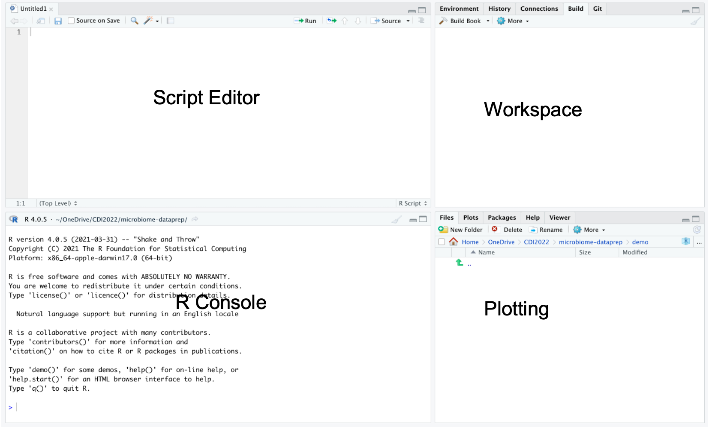

# Data Science & Visualization Tools
The most powerful tools for analyzing and visualizing microbiome data include:

- R and RStudio
- R-markdown
- Python
- Jupyter notebook


<!-- # Basic Software -->
## Installing R Environment 

<!-- <a href=""></a> -->
**R** is free software for statistical computing, data analysis, and graphics [@RCoreTeam2021]. We can install the R application on a personal computer to process the R programming language. You can download and install R using these steps:

1. Go to [https://www.r-project.org/](https://www.r-project.org/).
2. On the left, under Download, click on [CRAN](http://cran.r-project.org/mirrors.html) to access the mirrors. CRAN (Comprehensive R Archive Network) is mirrored on nearly 100 registered servers in almost 50 regions worldwide. See [CRAN mirror status](https://cran.r-project.org/mirmon_report.html).
3. https://cloud.r-project.org/ Pick a mirror close to your location, and automatically R will connect to that server, ready to download the package files.
4. Select a compatible platform to download precompiled binary distributions of the base system, which also come with contributed packages.

<br>

## Installing RStudio Environment

<!-- <a href=""></a> -->

**RStudio** is a free program integrating with R as an IDE (Integrated Development Environment) to implement most analytical functionalities [@RStudioTeam2021]. For effective analysis, we must install R before installing RStudio. We will intensively use RStudio IDE to give us a user interface. We are interested in **RStudio Desktop**, which is an open-source regular desktop application. You can install it like this:

1. Go to [https://rstudio.com/products/rstudio/](https://rstudio.com/products/rstudio/).
2. Click on [RStudio Desktop](https://rstudio.com/products/rstudio/#rstudio-desktop) box to move to the open source edition.
3. Choose your preferred [license](https://rstudio.com/products/rstudio/download/) either open source or commercial.
4. Select [installer](https://rstudio.com/products/rstudio/download/#download) compatible to your operating system.

<br>




<br>

## Installing Python
Python is installed through several methods. The most famous ways include:

- Direct [downloads](https://www.python.org/downloads/)
- Via environment and package management systems, for example [using conda](https://www.practicaldatascience.org/html/setup_python.html) like so:

```bash
conda config --add channels conda-forge

conda config --set channel_priority strict

conda install python=3.10
```

## Installing using `environment.yml`

```bash
name: python
channels:
    - conda-forge
dependencies:
    - python
    - python-abi
```

```bash
conda activate base
mamba env create --name python --file environment.yaml
```
