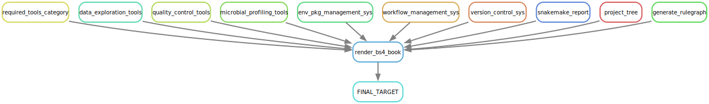

# (APPENDIX) APPENDIX {-}

# IMAP GitHub Repos

<div class="tmbinfo">
<table>
<colgroup>
<col width="32%" />
<col width="46%" />
<col width="20%" />
</colgroup>
<thead>
<tr class="header">
<th align="left">Repo</th>
<th>Description</th>
<th align="right">Status</th>
</tr>
</thead>
<tbody>
<tr class="odd">
<td align="left"><a
href="https://github.com/datainsights/imap-project-overview/">IMAP-OVERVIEW</a></td>
<td>IMAP project overview</td>
<td align="right"><a
href="https://datainsights.github.io/imap-project-overview/">In-progress</a></td>
</tr>
<tr class="even">
<td align="left"><a
href="https://github.com/tmbuza/imap-software-requirements/">IMAP-PART
01</a></td>
<td>Software requirement for microbiome data analysis with Snakemake
workflows</td>
<td align="right"><a
href="https://tmbuza.github.io/imap-software-requirements/">In-progress</a></td>
</tr>
<tr class="odd">
<td align="left"><a
href="https://github.com/tmbuza/imap-sample-metadata/">IMAP-PART
02</a></td>
<td>Downloading and exploring microbiome sample metadata from SRA
Database</td>
<td align="right"><a
href="https://tmbuza.github.io/imap-sample-metadata/">In-progress</a></td>
</tr>
<tr class="even">
<td align="left"><a
href="https://github.com/tmbuza/imap-download-sra-reads/">IMAP-PART
03</a></td>
<td>Downloading and filtering microbiome sequencing data from SRA
database</td>
<td align="right"><a
href="https://tmbuza.github.io/imap-download-sra-reads/">In-progress</a></td>
</tr>
<tr class="odd">
<td align="left"><a
href="https://github.com/tmbuza/imap-read-quality-control/">IMAP-PART
04</a></td>
<td>Quality Control of Microbiome Next Generation Sequencing Reads</td>
<td align="right"><a
href="https://tmbuza.github.io/imap-read-quality-control/">In-progress</a></td>
</tr>
<tr class="even">
<td align="left"><a
href="https://github.com/tmbuza/imap-bioinformatics-mothur/">IMAP-PART
05</a></td>
<td>Microbial profiling using MOTHUR and Snakemake workflows</td>
<td align="right"><a
href="https://tmbuza.github.io/imap-bioinformatics-mothur/">In-progress</a></td>
</tr>
<tr class="odd">
<td align="left"><a
href="https://github.com/tmbuza/imap-bioinformatics-qiime2/">IMAP-PART
06</a></td>
<td>Microbial profiling using QIIME2 and Snakemake workflows</td>
<td align="right"><a
href="https://tmbuza.github.io/imap-bioinformatics-qiime2/">In-progress</a></td>
</tr>
<tr class="even">
<td align="left"><a
href="https://github.com/tmbuza/imap-data-processing/">IMAP-PART
07</a></td>
<td>Processing Output from 16S-Based microbiome bioinformatics
pipelines</td>
<td align="right"><a
href="https://tmbuza.github.io/imap-data-processing/">In-progress</a></td>
</tr>
<tr class="odd">
<td align="left"><a
href="https://github.com/tmbuza/imap-exploratory-analysis/">IMAP-PART
08</a></td>
<td>Exploratory Analysis of 16S-Based Microbiome Processed Data</td>
<td align="right"><a
href="https://tmbuza.github.io/imap-exploratory-analysis/">In-progress</a></td>
</tr>
<tr class="even">
<td align="left"><a
href="https://github.com/tmbuza/imap-snakemake-workflows/">IMAP-SUMMARY</a></td>
<td>Summary of snakemake workflows for microbiome data analysis</td>
<td align="right"><a
href="https://tmbuza.github.io/imap-snakemake-workflows/">In-progress</a></td>
</tr>
</tbody>
</table>
</div>

# Essential Software Rulegraph



# Session Information

Reproducibility relies on the ability to precisely recreate the working environment, and session information serves as a vital reference to achieve this consistency. Here we record details about the R environment, package versions, and system settings of the computing environment at the time of analysis. 


```r
library(knitr)
library(sessioninfo)

# Get session info
info <- capture.output(print(session_info()))

# Create the 'resources' folder if it doesn't exist
if (!dir.exists("resources")) {
  dir.create("resources")
}

# Save the session information to a text file without line numbers
cat(info, file = "resources/session_info.txt", sep = "\n")

info
```

```
##  [1] "─ Session info ──────────────────────────────────────────────────────────────────────────────────────────────────────────────────────────────────────────────────────────────────"
##  [2] " setting  value"                                                                                                                                                                  
##  [3] " version  R version 4.3.2 (2023-10-31)"                                                                                                                                           
##  [4] " os       macOS Sonoma 14.2.1"                                                                                                                                                    
##  [5] " system   aarch64, darwin20.0.0"                                                                                                                                                  
##  [6] " ui       unknown"                                                                                                                                                                
##  [7] " language (EN)"                                                                                                                                                                   
##  [8] " collate  en_US.UTF-8"                                                                                                                                                            
##  [9] " ctype    en_US.UTF-8"                                                                                                                                                            
## [10] " tz       Africa/Dar_es_Salaam"                                                                                                                                                   
## [11] " date     2024-02-19"                                                                                                                                                             
## [12] " pandoc   3.1.3 @ /Users/tmbmacbookair/miniforge3/envs/microbiome_env/bin/ (via rmarkdown)"                                                                                       
## [13] ""                                                                                                                                                                                 
## [14] "─ Packages ──────────────────────────────────────────────────────────────────────────────────────────────────────────────────────────────────────────────────────────────────────"
## [15] " ! package     * version date (UTC) lib source"                                                                                                                                   
## [16] " P bookdown      0.37    2023-12-01 [?] CRAN (R 4.3.2)"                                                                                                                           
## [17] " P bslib         0.6.1   2023-11-28 [?] CRAN (R 4.3.2)"                                                                                                                           
## [18] " P cachem        1.0.8   2023-05-01 [?] CRAN (R 4.3.2)"                                                                                                                           
## [19] " P cli           3.6.2   2023-12-11 [?] CRAN (R 4.3.2)"                                                                                                                           
## [20] " P digest        0.6.34  2024-01-11 [?] CRAN (R 4.3.2)"                                                                                                                           
## [21] " P downlit       0.4.3   2023-06-29 [?] CRAN (R 4.3.2)"                                                                                                                           
## [22] " P evaluate      0.23    2023-11-01 [?] CRAN (R 4.3.2)"                                                                                                                           
## [23] " P fastmap       1.1.1   2023-02-24 [?] CRAN (R 4.3.2)"                                                                                                                           
## [24] " P fs            1.6.3   2023-07-20 [?] CRAN (R 4.3.2)"                                                                                                                           
## [25] " P htmltools     0.5.7   2023-11-03 [?] CRAN (R 4.3.2)"                                                                                                                           
## [26] " P jquerylib     0.1.4   2021-04-26 [?] CRAN (R 4.3.2)"                                                                                                                           
## [27] " P jsonlite      1.8.8   2023-12-04 [?] CRAN (R 4.3.2)"                                                                                                                           
## [28] " P knitr       * 1.45    2023-10-30 [?] CRAN (R 4.3.2)"                                                                                                                           
## [29] " P lifecycle     1.0.4   2023-11-07 [?] CRAN (R 4.3.2)"                                                                                                                           
## [30] " P memoise       2.0.1   2021-11-26 [?] CRAN (R 4.3.2)"                                                                                                                           
## [31] " P R6            2.5.1   2021-08-19 [?] CRAN (R 4.3.2)"                                                                                                                           
## [32] "   renv          1.0.3   2023-09-19 [1] CRAN (R 4.3.1)"                                                                                                                           
## [33] " P rlang         1.1.3   2024-01-10 [?] CRAN (R 4.3.2)"                                                                                                                           
## [34] " P rmarkdown     2.25    2023-09-18 [?] CRAN (R 4.3.2)"                                                                                                                           
## [35] " P sass          0.4.8   2023-12-06 [?] CRAN (R 4.3.2)"                                                                                                                           
## [36] " P sessioninfo * 1.2.2   2021-12-06 [?] CRAN (R 4.3.2)"                                                                                                                           
## [37] " P withr         3.0.0   2024-01-16 [?] CRAN (R 4.3.2)"                                                                                                                           
## [38] " P xfun          0.42    2024-02-08 [?] CRAN (R 4.3.2)"                                                                                                                           
## [39] " P xml2          1.3.6   2023-12-04 [?] CRAN (R 4.3.2)"                                                                                                                           
## [40] " P yaml          2.3.8   2023-12-11 [?] CRAN (R 4.3.2)"                                                                                                                           
## [41] ""                                                                                                                                                                                 
## [42] " [1] /Users/tmbmacbookair/Dropbox/2024/TMB2024/COMPLETED/imap-essential-software/renv/library/R-4.3/aarch64-apple-darwin20.0.0"                                                   
## [43] " [2] /Users/tmbmacbookair/Library/Caches/org.R-project.R/R/renv/sandbox/R-4.3/aarch64-apple-darwin20.0.0/c637371f"                                                                
## [44] ""                                                                                                                                                                                 
## [45] " P ── Loaded and on-disk path mismatch."                                                                                                                                          
## [46] ""                                                                                                                                                                                 
## [47] "─────────────────────────────────────────────────────────────────────────────────────────────────────────────────────────────────────────────────────────────────────────────────"
```


> For a detailed overview of the tools and versions suitable for this guide, I encourage you to explore the session information saved in the accompanying text file named `resources/session_info.txt`,


