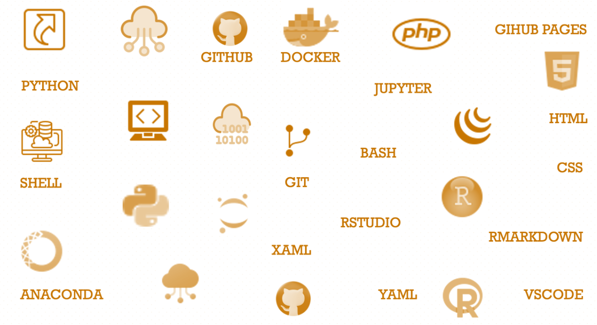

--- 
title: "<big>IMAP:</big> Integrated Microbiome Analysis Pipelines"
subtitle: "End-to-End Practical User Guides Using Integrated Approaches"
date:
- <b>2024-02-13</b>
author: Teresia Mrema-Buza
site: bookdown::bookdown_site
documentclass: book
css: style.css
csl: 
  - library/apa.csl
bibliography:
  - library/packages.bib
  - library/references.bib
  - library/imap.bib
citation_package:
  - natbib
  - biblatex
  - amsplain
url: https://tmbuza.github.io/imap-essential-software/
cover-image: images/planning.png
email_address: "ndelly@gmail.com"
github-repo: tmbuza/imap-project-overview
biblio-style: apalike
description: |
  | This part will be added before release.
---

<!-- # Google fonts -->
<link rel="preconnect" href="https://fonts.googleapis.com">
<link rel="preconnect" href="https://fonts.gstatic.com" crossorigin>
<link href="https://fonts.googleapis.com/css2?family=Anton" rel="stylesheet">
<link href="https://fonts.googleapis.com/css2?family=Roboto:wght@100;300;400;500;700,900&display=swap" rel="stylesheet">
<link href="https://fonts.googleapis.com/css2?family=Oswald:wght@300;400;700&display=swap" rel="stylesheet">
<link href="https://fonts.googleapis.com/css2?family=Merriweather:wght@300;400;700&display=swap" rel="stylesheet">
<link href="https://fonts.googleapis.com/css2?family=Montserrat:wght@100;200;300;400;700&display=swap" rel="stylesheet">

<!-- # CSS -->
<link rel="stylesheet" href="https://cdnjs.cloudflare.com/ajax/libs/font-awesome/5.15.3/css/all.min.css">
<link rel="stylesheet" href="https://cdnjs.cloudflare.com/ajax/libs/animate.css/4.1.1/animate.min.css">

# <big>Microbiome Data Analysis Toolkit</big> {-#analysis-toolkit}

 
 

 
 

Welcome to the **Microbiome Data Analysis Toolkit**! This practical user guide is more than just a manual; it's your dynamic gateway to preparing for a successful microbiome data analysis journey. The tools meticulously described in this guide are not only carefully curated but are also accompanied by step-by-step demonstrations to skillfully guide you through each stage of the process.

In this guide, you can expect hands-on demonstrations illustrating how to:

- Set up a robust working environment tailored for microbiome data analysis.
- Install and configure essential tools, ensuring a smooth and efficient start to your analytical journey.

As you explore the curated tools, you'll not only gain theoretical knowledge but also practical insights into their implementation. Each step is designed to empower you with the skills needed to navigate the complexities of microbiome data analysis confidently.

