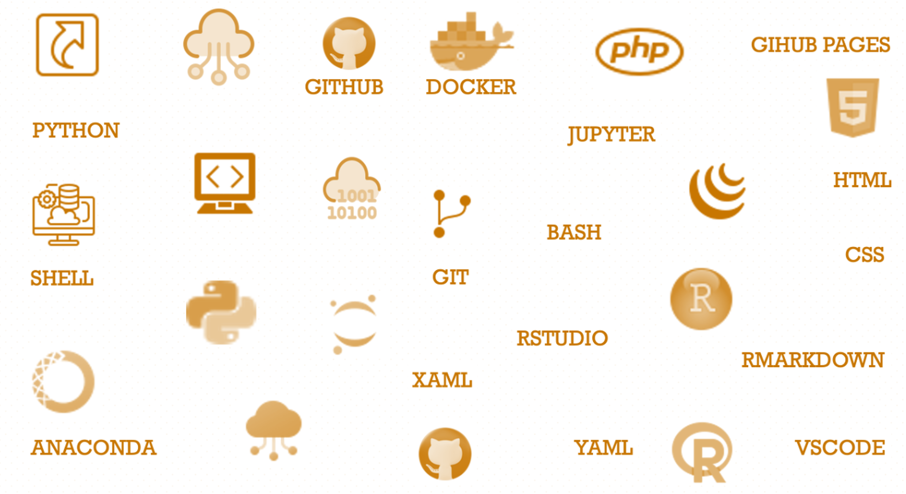

--- 
title: "<big>IMAP:</big> Integrated Microbiome Analysis Pipelines"
subtitle: "End-to-End Practical User Guides Using Integrated Approaches"
date:
- <b>`r Sys.Date()`</b>
author: Teresia Mrema-Buza
site: bookdown::bookdown_site
documentclass: book
css: style.css
csl: 
  - library/apa.csl
bibliography:
  - library/packages.bib
  - library/references.bib
  - library/imap.bib
citation_package:
  - natbib
  - biblatex
  - amsplain
url: https://tmbuza.github.io/imap-essential-software/
cover-image: images/planning.png
email_address: "ndelly@gmail.com"
github-repo: tmbuza/imap-essential-software
biblio-style: apalike
description: |
  | This part will be added before release.
---

```{r lockfile, include=FALSE}
source("_common.R")

```


<!-- # Google fonts -->
<link rel="preconnect" href="https://fonts.googleapis.com">
<link rel="preconnect" href="https://fonts.gstatic.com" crossorigin>
<link href="https://fonts.googleapis.com/css2?family=Anton" rel="stylesheet">
<link href="https://fonts.googleapis.com/css2?family=Roboto:wght@100;300;400;500;700,900&display=swap" rel="stylesheet">
<link href="https://fonts.googleapis.com/css2?family=Oswald:wght@300;400;700&display=swap" rel="stylesheet">
<link href="https://fonts.googleapis.com/css2?family=Merriweather:wght@300;400;700&display=swap" rel="stylesheet">
<link href="https://fonts.googleapis.com/css2?family=Montserrat:wght@100;200;300;400;700&display=swap" rel="stylesheet">

<!-- # CSS -->
<link rel="stylesheet" href="https://cdnjs.cloudflare.com/ajax/libs/font-awesome/5.15.3/css/all.min.css">
<link rel="stylesheet" href="https://cdnjs.cloudflare.com/ajax/libs/animate.css/4.1.1/animate.min.css">


# **IMAP-Part 01**: Microbiome Data Analysis Toolkit for Reproducible Results {-#analysis-toolkit}



## Fostering Reproducibility in Microbiome Data Analysis {-}

In the realm of microbiome data analysis, reproducibility is a cornerstone that ensures the reliability and integrity of research findings. The ability to reproduce analyses allows researchers to validate results, verify methodologies, and build upon existing work. Reproducibility fosters transparency, enabling the scientific community to scrutinize and refine studies, ultimately enhancing the robustness of conclusions and contributing to the cumulative knowledge base. This practical user guide is more than just a manual; it's your dynamic gateway to preparing for a successful microbiome data analysis journey.

## How to Use {-}
- Succeeding chapters may contain R code snippets enclosed in R chunks.
- Follow along and execute the provided code snippets in your R environment for hands-on learning.

## What to Expect {-}
- **Setting Up a Robust Environment:** Learn how to establish a solid working foundation tailored for microbiome data analysis.
- **Installing and Configuring Essential Tools:** Ensure a smooth and efficient start to your analytical journey by mastering the installation and configuration of crucial tools.

As you explore these curated tools, you'll gain not only theoretical knowledge but also practical insights into their implementation. Each step is designed to empower you with the skills needed to navigate the intricacies of microbiome data analysis confidently.

## Prerequisites {-}
Basic knowledge of R and RStudio.

Enjoy your learning journey with essential toolkits!
